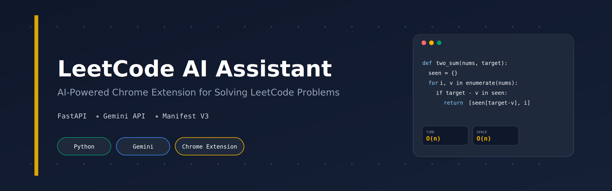
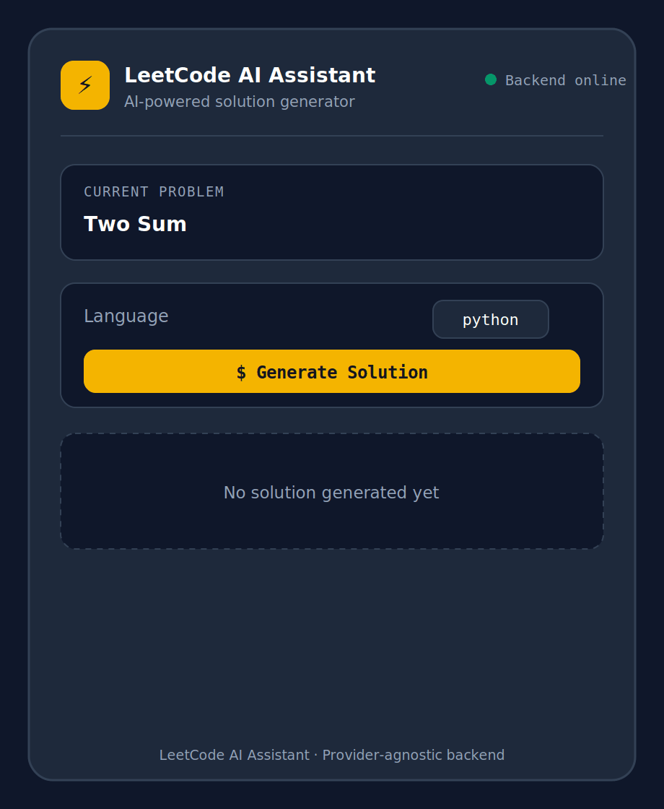
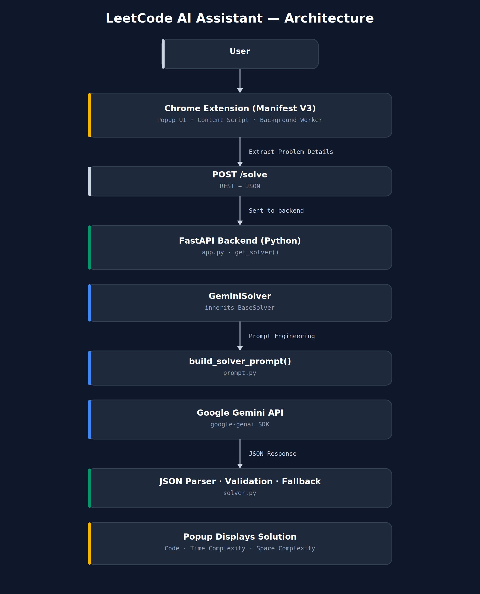
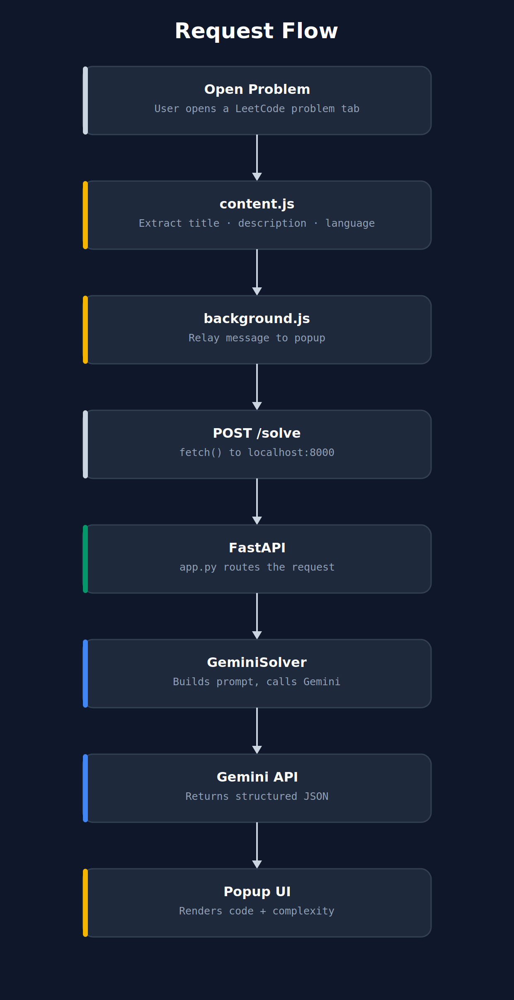
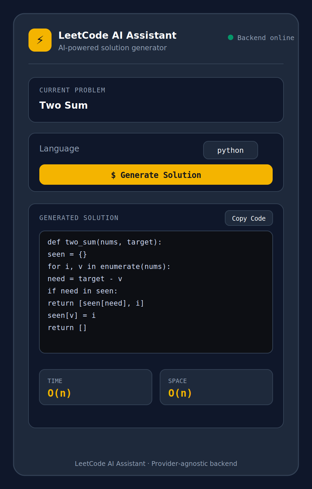
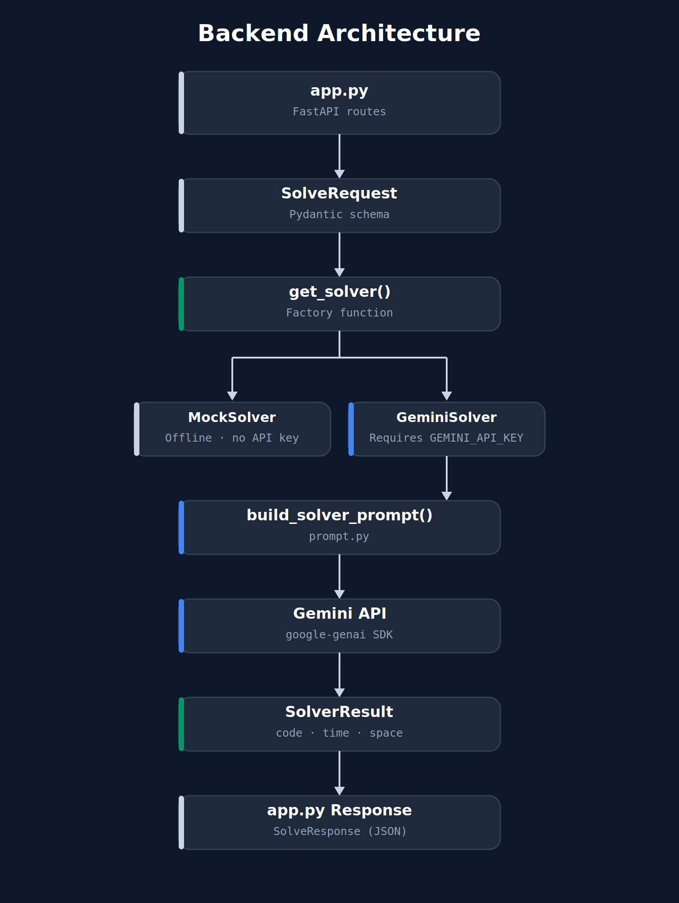

<div align="center">



<h1>LeetCode AI Assistant</h1>

<p>
AI-Powered Chrome Extension for Solving Coding Problems using Google's Gemini API
</p>

<p>
  
  
  
  
  
  
</p>

</div>

---

## Demo

<div align="center">
  
</div>

---

## Overview

**LeetCode AI Assistant** is a Chrome Extension powered by Google's Gemini API that extracts coding problems directly from the browser, sends them to a FastAPI backend, and generates optimized solutions with time and space complexity analysis — without ever leaving the LeetCode tab.

The backend follows a **provider-agnostic architecture** through a `BaseSolver` interface, making it straightforward to integrate different LLM providers such as Gemini, OpenAI, Claude, or Ollama with minimal code changes. Today it ships wired to `GeminiSolver`; a fully offline `MockSolver` is also included for development without any API key.

---

## Features

- ✔ Chrome Extension (Manifest V3)
- ✔ FastAPI Backend
- ✔ Gemini Integration (`google-genai` SDK)
- ✔ Structured Prompt Engineering
- ✔ Multi-language Support (Python, JavaScript, Java, C++)
- ✔ Strict JSON Parsing & Validation
- ✔ Automatic Fallback Handling on Malformed Responses
- ✔ Provider-Agnostic Solver Architecture (`BaseSolver`)
- ✔ Real-Time Code Generation
- ✔ REST API Communication with Live Backend Status
- ✔ One-Click Code Copy
- ✔ Friendly Error Handling (offline backend, invalid page, empty response)

---

## Architecture

<div align="center">
  
</div>

The extension extracts the problem from the browser DOM via a content script.

The popup sends a `POST /solve` request to the FastAPI backend running locally.

The backend delegates solving to a provider-specific implementation through the `BaseSolver` interface, resolved by `get_solver()`.

`GeminiSolver` builds a structured prompt with `build_solver_prompt()`, queries the Gemini API, validates and parses the returned JSON, and returns a structured `SolverResult` back through the API to the extension popup.

---

## Workflow

<div align="center">
  
</div>

1. User opens a LeetCode problem page.
2. `content.js` extracts the title, description, examples, and constraints.
3. `popup.js` sends the extracted data to `POST /solve`.
4. FastAPI routes the request to `GeminiSolver`.
5. `GeminiSolver` builds the prompt and calls the Gemini API.
6. The response is parsed into structured JSON (`code`, `time_complexity`, `space_complexity`).
7. The popup renders the generated solution with complexity pills and a copy-to-clipboard action.

---

## Screenshots

<div align="center">

| Popup UI | Backend Architecture |
|:---:|:---:|
|  |  |

</div>

---

## Tech Stack

| Layer         | Technologies                                            |
| ------------- | -------------------------------------------------------- |
| Frontend      | Chrome Extension (Manifest V3), HTML, CSS, JavaScript    |
| Backend       | FastAPI, Python, Uvicorn                                  |
| AI            | Google Gemini (`gemini-3.5-flash`), `google-genai` SDK    |
| Communication | REST API, JSON                                            |
| Development   | VS Code, Git, GitHub                                       |

---

## Project Structure

```
leetcode-ai-extension/
│
├── backend/
│   ├── app.py              # FastAPI app: /solve, /health routes
│   ├── solver.py           # BaseSolver, MockSolver, GeminiSolver
│   ├── prompt.py           # Shared prompt-building utility
│   ├── requirements.txt    # Python dependencies
│   └── .env.example        # Placeholder env vars (GEMINI_API_KEY, etc.)
│
├── chrome-extension/
│   ├── manifest.json       # Manifest V3 config
│   ├── popup.html          # Popup UI markup
│   ├── popup.css           # Dark "compiler console" theme
│   ├── popup.js            # Popup logic: extraction, API calls, rendering
│   ├── content.js          # Injected script: DOM extraction from LeetCode
│   ├── background.js       # Service worker
│   └── icons/              # Extension icons (16/48/128 px)
│
├── assets/
│   ├── architecture.png
│   ├── workflow.png
│   ├── backend.png
│   ├── popup.png
│   ├── demo.gif
│   └── banner.png
│
└── README.md
```

---

## Installation

### Prerequisites
- Python 3.9+
- Google Chrome (or any Chromium-based browser supporting Manifest V3)
- A [Gemini API key](https://aistudio.google.com/apikey) (free tier available)

### Clone the repository

```bash
git clone https://github.com/<your-username>/leetcode-ai-extension.git
cd leetcode-ai-extension
```

### Set up the backend

```bash
cd backend

# Create a virtual environment
python -m venv venv
source venv/bin/activate      # Windows: venv\Scripts\activate

# Install dependencies
pip install -r requirements.txt

# Configure your API key
cp .env.example .env
# then edit .env and set GEMINI_API_KEY=your_key_here

# Run the server
uvicorn app:app --reload --port 8000
```

Verify it's running:

```bash
curl http://localhost:8000/health
# {"status":"ok","solver":"GeminiSolver"}
```

> Prefer to run without an API key? Swap `get_solver()` in `solver.py` to `return MockSolver()` — no other file needs to change.

### Load the Chrome Extension

1. Open `chrome://extensions` in Chrome.
2. Enable **Developer mode**.
3. Click **Load unpacked** and select the `chrome-extension/` folder.
4. Pin the extension, then open any `leetcode.com/problems/*` page.
5. Click the extension icon, choose a language, and click **Generate Solution**.

---

## Usage

1. Navigate to a LeetCode problem, e.g. `https://leetcode.com/problems/two-sum/`.
2. Open the extension popup — the problem title populates automatically and the backend status indicator turns green.
3. Select a target language from the dropdown.
4. Click **Generate Solution** to fetch an AI-generated solution with time/space complexity.
5. Click **Copy Code** to copy the result to your clipboard.

---

## API Endpoints

### `GET /health`

Lightweight health check used by the popup to display the backend status indicator.

```json
{ "status": "ok", "solver": "GeminiSolver" }
```

### `POST /solve`

Generates a solution for a given problem.

**Request**

```json
{
  "title": "Two Sum",
  "description": "Given an array of integers nums and an integer target...",
  "language": "python"
}
```

**Response**

```json
{
  "code": "def two_sum(nums, target):\n    ...",
  "time_complexity": "O(n)",
  "space_complexity": "O(n)"
}
```

Interactive Swagger docs are available at `http://localhost:8000/docs` while the server is running.

---

## Future Improvements

- Add support for additional LLM providers through the `BaseSolver` interface (OpenAI, Claude, Ollama).
- Stream token generation for faster, incremental responses.
- Cache repeated solutions to reduce API calls.
- Add authentication for hosted/multi-user deployments.
- Improve prompt optimization and response validation.
- Expand language support and add automated tests.

---

## License

This project is licensed under the [MIT License](LICENSE).

---

<div align="center">
  <sub>Built as part of an AI Engineering portfolio. Respect LeetCode's terms of service when using automated tooling on their platform.</sub>
</div>
